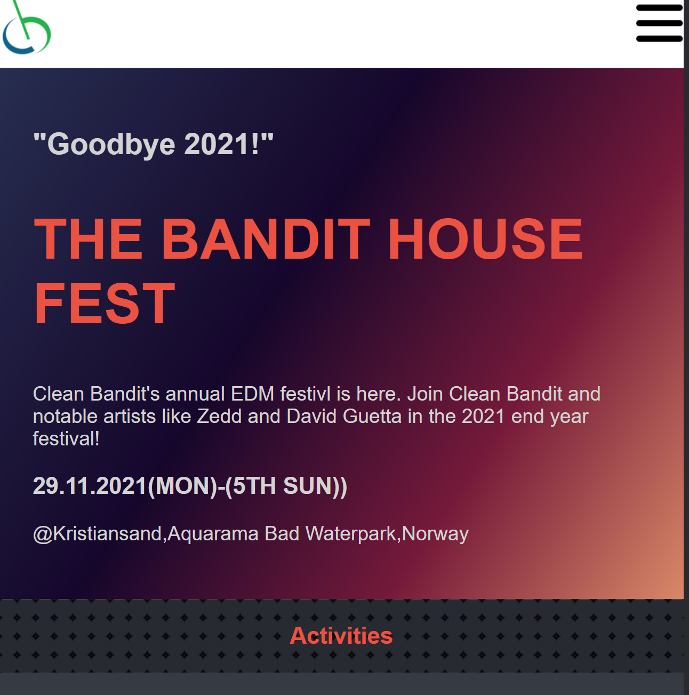
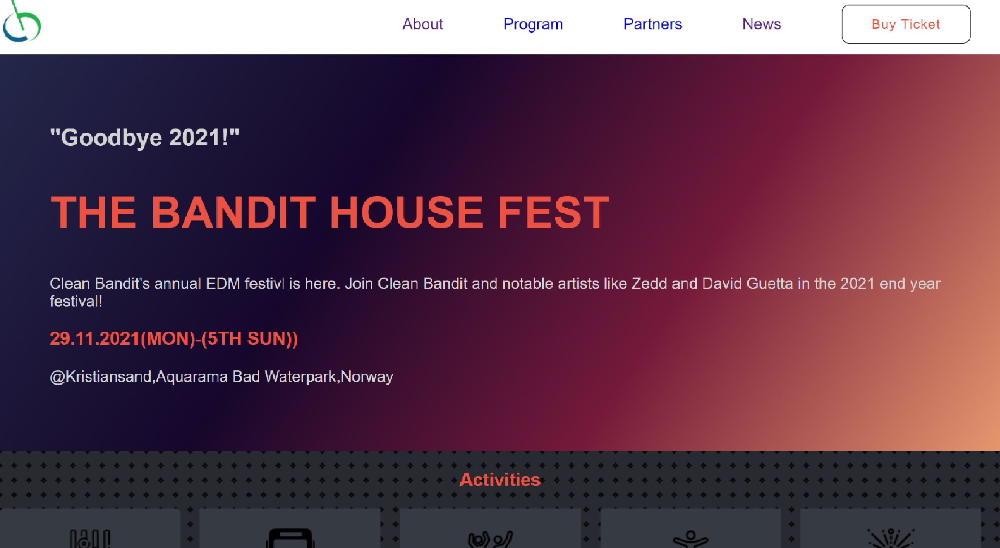

## The Capstone Project

> The project is the last project for the first Module of the microverse coding school. It's a simple annual music festival website where you can get information and also get a link to book a ticket

## Built With

- Javascript
- HTML
- CSS

## Live Demo

[Live Demo Link](https://livedemo.com)

To get a local copy up and running follow these simple example steps.

### Prerequisites

You should have a basic grasp of the languages above, javascript,html,css

### Setup

Clone the repository from Github and then use the text editor to make changes to the project

### Install

instal Vscode(optional) to edit the work.You should also have git installed as well as git bash command line

### Usage

The project should be used for entertainment/education purposes only

### Run tests

use the linter checkers provided by Microverse for the project

### Deployment

Use github pages to see the live version of the project

## Authors

👤 **Author1**

- GitHub: [@DelhinRhar](https://github.com/DelhinRharl)
- Twitter: [@DelhinRharl(https://twitter.com/DelhinRharl)
- LinkedIn: [LinkedIn](https://linkedin.com/in/Affaxed Kiprotich)

#

## Show your support

Give a ⭐️ if you like this project!

## Acknowledgments

- Hat tip to flaticons,icons8 and fontawesome for the icons
- Cindy Shin - Provided the template for the Project
- wallpaperaccess and pinterest for the various images

## 📝 License

This project is [MIT](./MIT.md) licensed.
